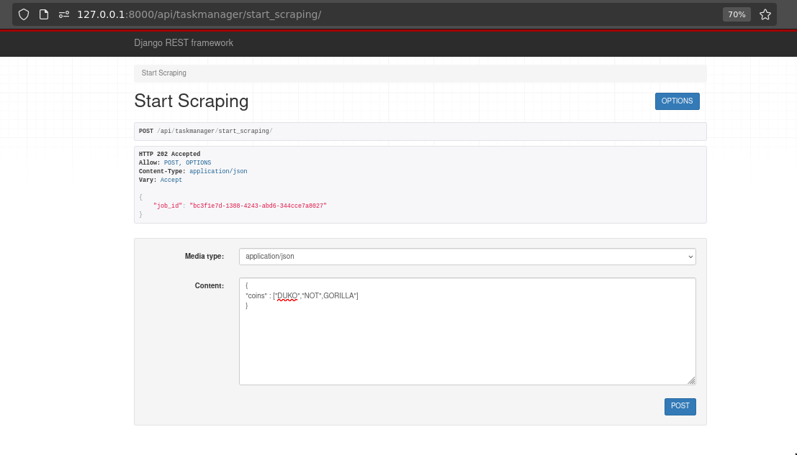
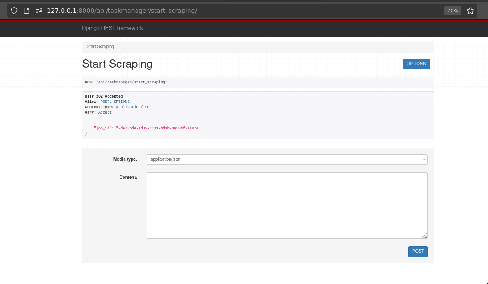
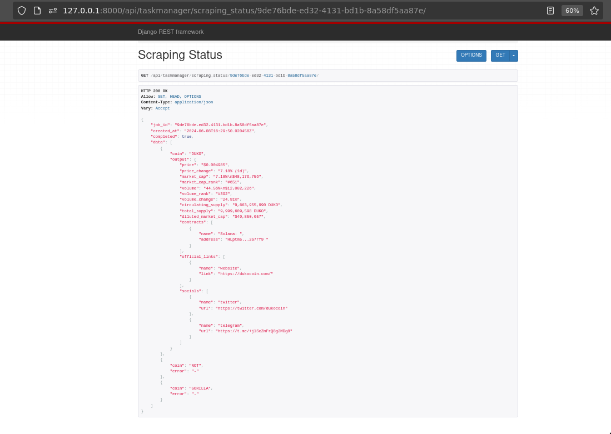
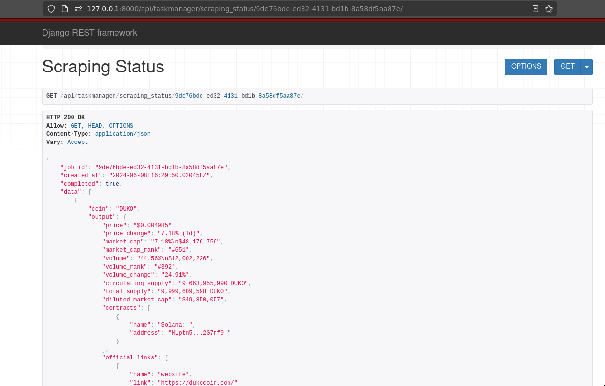
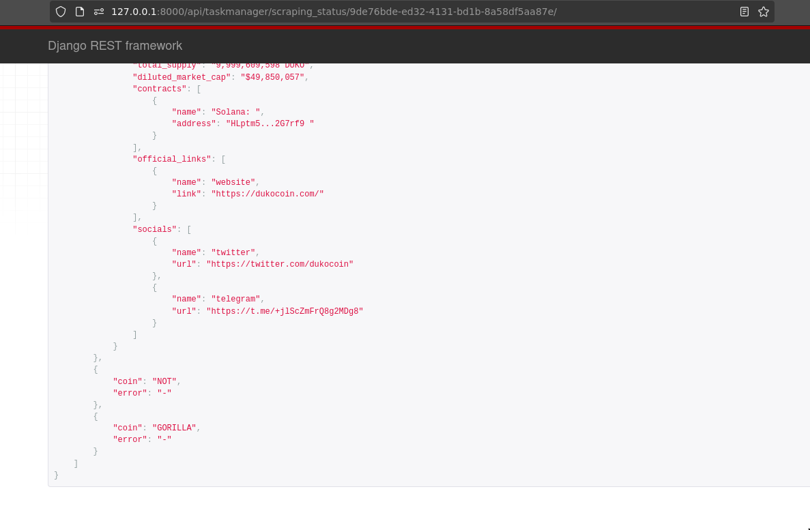
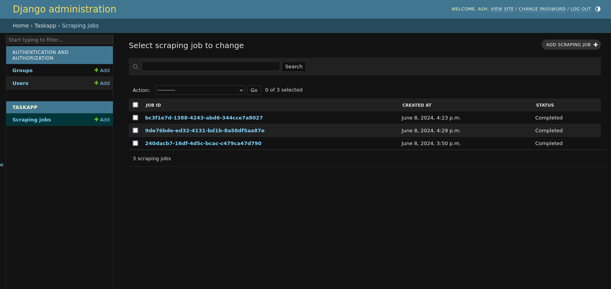
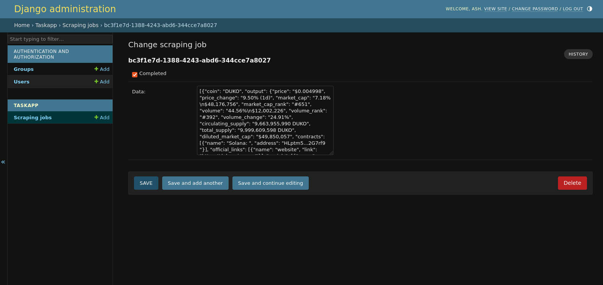

# TaskManager

TaskManager is a Django REST Framework API designed to scrape data from the CoinMarketCap website and provide JSON responses. It utilizes Celery for asynchronous task management and integrates with Selenium for web scraping.

Redis is used as the message broker in Celery. Chrome is used as the webdriver in Selenium.

## Overview

The goal of this project is to create a Django API that scrapes data from CoinMarketCap and returns the scraped data in JSON format. The project includes two main API endpoints:

1. **Start Scraping Endpoint** (`/api/taskmanager/start_scraping [POST]`):
   - Accepts a list of crypto coin acronyms.
   - Initiates scraping jobs for these coins in parallel using Celery.
   - Returns a job ID.

2. **Scraping Status Endpoint** (`/api/taskmanager/scraping_status/<job_id> [GET]`):
   - Accepts a job ID.
   - Retrieves the currently scraped data for the specified job.

## Libraries Used

- Django REST Framework
- Celery
- Requests
- Selenium

## Usage

1. Clone the repository:

   ```bash
   git clone https://github.com/binaryash/taskmanager.git
   ```

2. Install dependencies:

   ```bash
   pip install -r requirements.txt
   ```

3. Run migrations:

   ```bash
   python manage.py migrate
   ```

4. Start the Redis server:

   ```bash
   redis-server
   ```

5. Start the Celery worker:

   ```bash
   celery -A taskmanager worker -l info
   ```

6. Run the Django development server:

   ```bash
   python manage.py runserver
   ```

7. Use the following endpoints to interact with the API:

   - **Start Scraping:** `POST /api/taskmanager/start_scraping`
   - **Scraping Status:** `GET /api/taskmanager/scraping_status/<job_id>`

## Screenshots





### Output Screenshots: 







### Admin Panel





## Output

### Input value

```json
{
    "coins":["DUKO","NOT","GORILLA"]
}
```
### Output value

```json
GET /api/taskmanager/scraping_status/9de76bde-ed32-4131-bd1b-8a58df5aa87e/

HTTP 200 OK
Allow: GET, HEAD, OPTIONS
Content-Type: application/json
Vary: Accept

{
    "job_id": "9de76bde-ed32-4131-bd1b-8a58df5aa87e",
    "created_at": "2024-06-08T16:29:50.020458Z",
    "completed": true,
    "data": [
        {
            "coin": "DUKO",
            "output": {
                "price": "$0.004985",
                "price_change": "7.18% (1d)",
                "market_cap": "7.18%\n$48,176,756",
                "market_cap_rank": "#651",
                "volume": "44.56%\n$12,002,226",
                "volume_rank": "#392",
                "volume_change": "24.91%",
                "circulating_supply": "9,663,955,990 DUKO",
                "total_supply": "9,999,609,598 DUKO",
                "diluted_market_cap": "$49,850,057",
                "contracts": [
                    {
                        "name": "Solana: ",
                        "address": "HLptm5...2G7rf9 "
                    }
                ],
                "official_links": [
                    {
                        "name": "website",
                        "link": "https://dukocoin.com/"
                    }
                ],
                "socials": [
                    {
                        "name": "twitter",
                        "url": "https://twitter.com/dukocoin"
                    },
                    {
                        "name": "telegram",
                        "url": "https://t.me/+jlScZmFrQ8g2MDg8"
                    }
                ]
            }
        },
        {
            "coin": "NOT",
            "error": "-"
        },
        {
            "coin": "GORILLA",
            "error": "-"
        }
    ]
}

```

## Contributing

Contributions are welcome! Please fork the repository and submit a pull request.

## License

This project is licensed under the GPL-3.0 License - see the [LICENSE](LICENSE) file for details.


